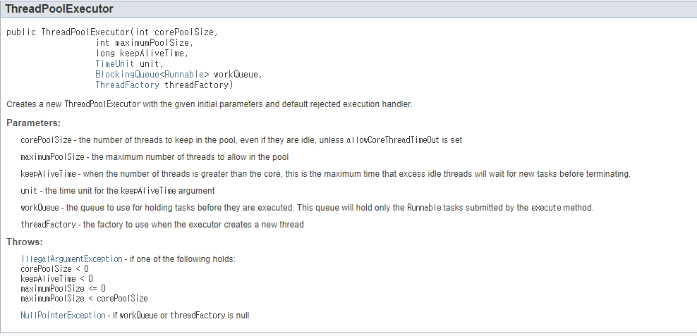
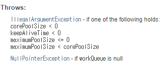

# 정리

## multimodule 컴포넌트 스캔의 2가지 방식

상위 module에서 하위 모듈의 컴포넌트를 스캔하는 방법은 2가지가 있다.
```text
* 상위 module과 하위 module 간의 패키지 경로 일치화
* SpringBootApplication 어노테이션의 scanBasePackages에 스캔하려는 컴포넌트의 패키지 경로를 명시
```
scanBasePackages을 이용하여 명시를 하는 것이 하위 모듈이 수십개가 있더라도 명시되어 있는 패키지 경로만 스캔하기 때문에 좀더 시간을 단축 시킬수 있다.

## 각각의 module에서 gradle에 설정해야할 옵션


```xml
tasks.getByName<BootJar>("bootJar") {
    //true 로 설정하게 되면 main 클래스를 찾기 때문에 에러가 발생
    enabled = false
}
    
tasks.getByName<Jar>("jar") { 
    //true로 설정하면 xxx-plain.jar 파일이 생성(클래스와 리소스만 포함)
    enabled = true
}
```

## gradle 명령여
```text
./gradlew clean :module-api:buildNeeded --stacktrace --info --refresh-dependencies -x test

clean                   -> 기존 빌드되어 있는 파일들일 삭제
:module-api:buildNeeded -> 어떤 모듈을 빌드할것인지 지정
--stacktrace           -> 실행 로그를 보여달라
--info                  -> 로그 레벨 지정   (debug -> info -> warn -> error)
--refresh-dependencies  -> dependencies를 한번더 로드
-x test                 -> 테스트 코드
```

## 비동기 프로그래밍
실시간성 응답을 필요로 하지 않는 상황에서 사용  
ex) Notification, Email 전송, Push

Main Thread 가 Task 를 처리하는 게 아니라 Sub Thread 에게 Task를 위임하는 행위  
스프링에서는 ThreadPool을 생성하여 Async 작업을 처리
```text
* CorePoolSize  - ThreadPool에 최소한 스레드를 몇 개 가지고 있을 것이냐를 지정하는 옵션
* MaxPoolSize   - ThreadPool에 최대 몇개까지 스레드를 할당할 것 인지
* WorkQueue     - 먼저 들어온 요청을 먼저 처리할 수 있는 자료구조인 큐를 사용하여 워크큐 라는곳에 저장
* KeepAliveTime - 지정한 시간만큼 스레드가 아무런 일을 하지 않으면 반납
```



순서 : 코어풀 사이즈 만큼 스레드 생성(ex:3) -> 리퀘스트 4개 요청 -> 코어풀 사이즈 만큼 작업 시작 ->   
       4번째 리퀘스트는 바로 새로운 스레드를 만드는것이 아닌 워크큐에 저장 -> 워크큐에 지정한 사이즈만큼 요청이 쌓였으면 MaxPoolSize만큼 Thread 생성  
       
### !주의
- CorePoolSize 값을 너무 크게 설정할 경우 너무 많이 놀고 있는 Thread가 있을 수 있다.
- 아래 이미지와 같이 설정하면 NullPointException  
